# UNet COT-FM Experiment Tracking

**Goal:** `pqm/chi2_best_mean ≈ 99`
The χ² histogram of the best checkpoint must overlap with χ²(dof=98).
Good summary statistics are also required: power spectrum and pixel PDF of generated maps must match the N-body target distribution.

**Branch:** `u/Justinezgh/unet_exp`
**W&B project:** `neurips-wl-challenge` (entity: `cosmostat`)

---

## Performance metrics

| Metric | Description | Target |
|--------|-------------|--------|
| `pqm/chi2_best_mean` | PQMass mean χ² using the **best** checkpoint (lowest val_loss) | ≈ 99 |
| `pqm/chi2_last_mean` | PQMass mean χ² using the **last** checkpoint | informative only |
| `val_loss` | Flow matching loss on test set | proxy for early ranking |

Both PQMass scores are computed post-training on 500 fixed test maps (seed=42).

---

## How to run experiments

```bash
# Generic launcher — takes experiment YAML as argument
python cosmoford/emulator/cot_fm.py --exp_config configs/experiments/unet_exp/<config>.yaml
```

Before running Phase N: fill in the `# TODO` fields in the YAML files
with the best values from previous phases.

---

## Baseline hyperparameters

| Parameter | Value | Config |
|-----------|-------|--------|
| Architecture | medium [32, 64, 128] | `unet_condition.yaml` |
| OT method | sinkhorn | — |
| `eps` | 0.1 | — |
| `ot_reg` | 0.1 | — |
| `sigma` | 0.001 | — |
| `base_lr` | 1e-3 | — |
| `gamma` | 0.9 | — |
| `num_epochs` | 100 | — |
| `batch_size` | 500 | — |

Config: `configs/experiments/baseline.yaml`

---

## Phase ordering rationale

| Phase | What | Why here |
|-------|------|----------|
| −1 | OT diagnostic (no training) | Cheap proxy to narrow eps/ot_reg/method candidates |
| 0 | `eps` | Defines the cost function shape — most foundational |
| 1 | OT method + `ot_reg` | Solver quality for the fixed cost function |
| 2 | Architecture | Minimum capacity once learning problem is fixed |
| 3 | `sigma` | FM noise regularization, depends on architecture |
| 4 | LR schedule | Pure optimization — most sensitive to architecture |

---

## Pre-Phase: EMD timing test

```bash
python scripts/time_emd.py
```

| SLURM job | Max feasible batch size | Notes |
|-----------|------------------------|-------|
| 8338582 | **500** | 0.02s/solve at bs=500 → 3.6M steps/day, all batch sizes feasible |

`batch_size: 500` set in `configs/experiments/unet_exp/phase1_emd.yaml`.

---

## Phase −1 — OT pairing diagnostic (no UNet training)

**Goal:** cheaply evaluate OT pairing quality for each (eps, ot_reg, ot_method)
to narrow candidates before submitting 24h training jobs.

**Script:** `scripts/ot_diagnostic.py`
**Output:** `/lustre09/project/6091102/juzgh/cosmoford_exp/ot_diagnostic/`

**Metrics computed:**

| Metric | Formula | Interpretation |
|--------|---------|---------------|
| `r_omega_c`, `r_s8` | `pearsonr(θ_x0, T_norm @ θ_x1)` | **Not reliable** — see note below |
| `E[\|Δθ\|]` (delta_Ωc, delta_S8) | `Σ_ij T[i,j] · \|θ_x0[i] − θ_x1[j]\|` | Expected per-pair cosmo mismatch under the plan. Uniform T → same as random. Permutation T → true mismatch. |
| `mean_displacement` | `Σ_ij T[i,j] · C_x[i,j]` | Expected ‖x0 − x1‖² under the plan — same formula as E[\|Δθ\|] |
| `entropy H(T)` | `−Σ_ij T[i,j] log T[i,j]` | log(n)=6.2 = permutation; 2·log(n)=12.4 = uniform |
| Natural eps | `E[C_y] / E[C_x]` | eps at which cosmo and spatial costs balance |

> **Why `r` is not a good metric:** `T_norm @ θ_x1` is the soft weighted average of all targets. For near-uniform T, all rows give ≈ `mean(θ_x1)` plus a tiny cosmo-aligned perturbation. Pearson r is shift-invariant and scale-invariant — the constant mean cancels, and even a vanishingly small correlated residual gives r ≈ 1. The 99.8% wrong pairs wash out to a constant and are invisible. `E[|Δθ|]` does not have this problem: for uniform T it equals the random pairing baseline by construction.

| SLURM job | Natural eps | Notes |
|-----------|-------------|-------|
| 8357197 | **0.0014** | E[C_x]=41.75 (spatial), E[C_y]=0.060 (cosmo) |

**Full diagnostic results (job 8412161):**

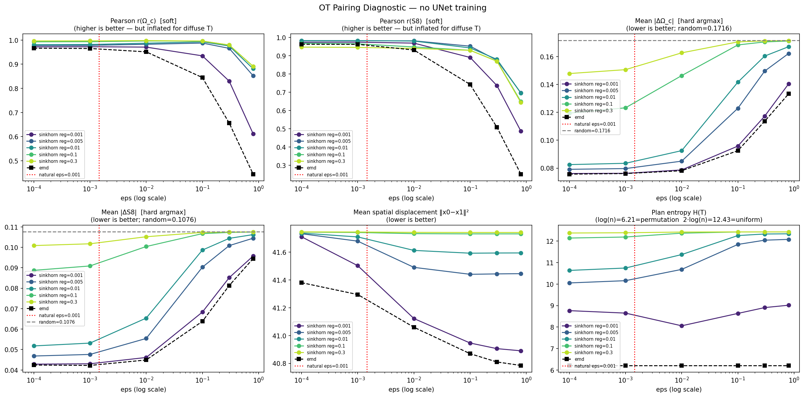

**Conclusions:**

1. **`r` is not a reliable metric** — for near-uniform T, the 99.8% wrong pairs average to a constant and cancel in the Pearson correlation. Use `E[|Δθ|]` and `H(T)` instead.

2. **eps=0.0001 and eps=0.001 give identical results** — once below natural_eps (0.0014), cosmo cost already dominates. Use eps=0.001.

3. **ot_reg ≥ 0.01 gives near-uniform coupling** — H ≈ 12.4 = 2·log(500) = max entropy, meaning essentially random pairing. `E[|Δθ|]` equals the random baseline. Drop from consideration.

4. **ot_reg=1e-3 (sinkhorn) gives the most structured sinkhorn coupling** (H≈8.1–8.9, E[|Δθ|] below random baseline), but convergence warnings at 10000 iterations — use `sinkhorn_log` + higher `numItermax` in training.

5. **EMD gives the sharpest coupling** (H=6.2 = log(500) = permutation). Best `E[|Δθ|]`. Clear winner on coupling quality.

6. **Spatial displacement barely moves** across all configs — OT achieves cosmological matching only (concentration of measure in high dimensions).

**Decision:** skip Phase 0 and Phase 1 ablations — run **eps=0.001, sinkhorn_log ot_reg=1e-3** and **eps=0.001, EMD** in parallel to compare the two most principled configurations.

---


## Phase 0+1 — eps + OT method (collapsed)

**Decision from Phase −1 diagnostic:** skip ablations, go directly with **eps=0.001, sinkhorn, ot_reg=1e-3**.
- eps=0.001 ≈ natural_eps, cosmo cost dominates, no benefit to smaller eps
- ot_reg=1e-3 gives the most structured sinkhorn coupling (H≈8.1–8.9, E[|Δθ|] below random)
- ot_reg ≥ 0.01 → near-uniform → dropped
- EMD would give sharper coupling (H=6.2) but sinkhorn ot_reg=1e-3 provides soft stochastic pairings that may help generalisation; start here first

| W&B run name | eps | ot_method | ot_reg | SLURM job | `pqm/chi2_best` | `pqm/chi2_last` | `val_loss` | Notes |
|---|---|---|---|---|---|---|---|---|
| `unet/phase1/sinkhorn_reg1e-3` | 0.001 | sinkhorn_log | 1e-3 | 8413661 | — | — | 24.76 | [config](../configs/experiments/unet_exp/phase1_sinkhorn_reg1e-3.yaml) · [W&B](https://wandb.ai/cosmostat/neurips-wl-challenge/runs/78t344gz) · stopped ep.87, PQMass not run |
| `unet/phase1/emd` | 0.001 | emd | — | 8413662 | **113.55** | 110.40 | 24.32 | [config](../configs/experiments/unet_exp/phase1_emd.yaml) · [W&B](https://wandb.ai/cosmostat/neurips-wl-challenge/runs/fm5v6kxv) · exact bijection per step, H=6.2 |

**Power spectrum (best checkpoint):**

| p1_emd | p1_sink_1e-3 |
|--------|-------------|
| 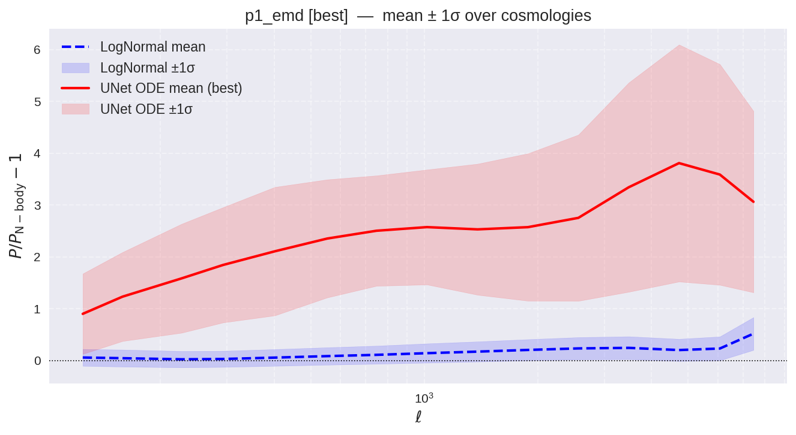 | 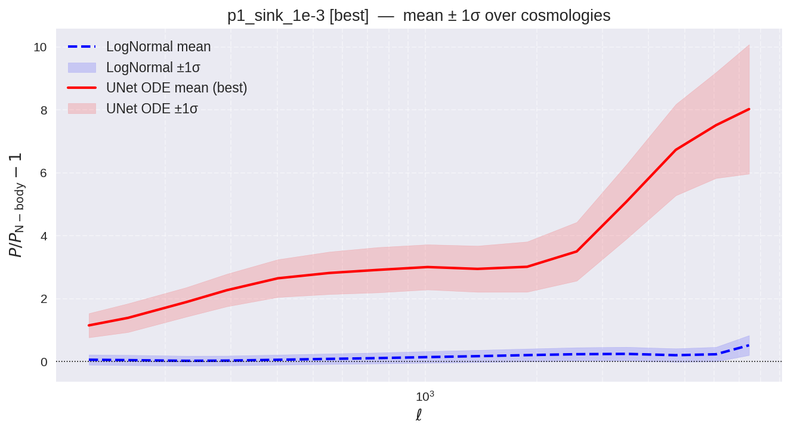 |

**Pixel PDF (best checkpoint):**

| p1_emd | p1_sink_1e-3 |
|--------|-------------|
| 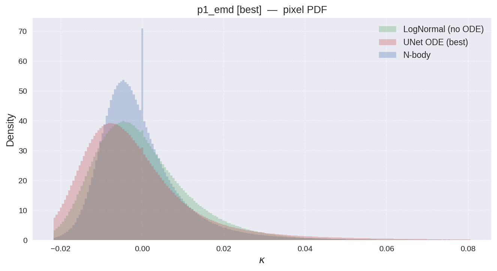 | 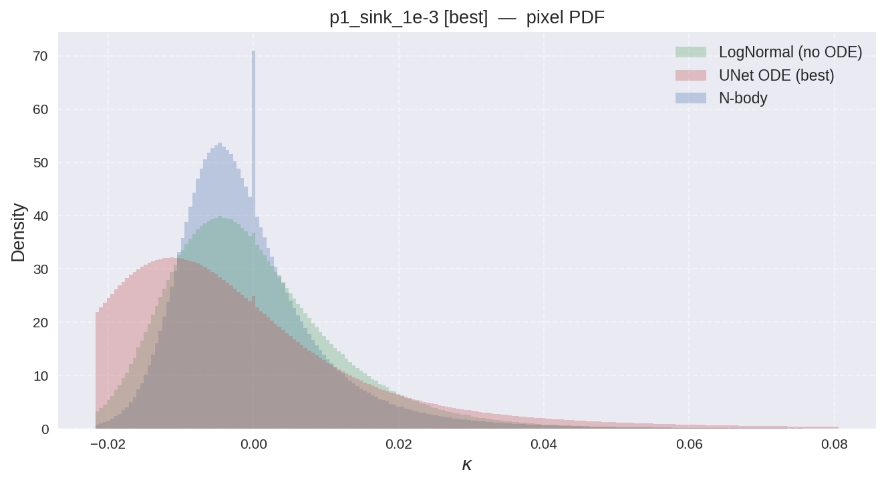 |

**Decision: proceed with EMD** — χ²_best=113.6 (emd) vs sinkhorn still training; emd shows sharper PS correction toward N-body. Phase 2 uses `ot_method: emd, eps: 0.001`.

---

## Phase 2 — Architecture ablation

**Varying:** UNet size. **Fixed:** best eps + best OT from Phases 0–1.

| W&B run name | Channels | Config | SLURM job | `pqm/chi2_best` | `pqm/chi2_last` | `val_loss` | Notes |
|--------------|----------|--------|-----------|-----------------|-----------------|------------|-------|
| `unet/phase2/arch_small` | [16, 32] | [config](../configs/experiments/unet_exp/phase2_arch_small.yaml) | 8450407 | **108.70** | 106.48 | 24.76 | emd, eps=0.001 · [W&B](https://wandb.ai/cosmostat/neurips-wl-challenge/runs/xlwuyvlw) |
| `unet/phase2/arch_medium` | [32, 64, 128] | — | — | 113.55 | 110.40 | 24.32 | reuse p1_emd · [W&B](https://wandb.ai/cosmostat/neurips-wl-challenge/runs/fm5v6kxv) |
| `unet/phase2/arch_large` | [32, 64, 128, 256] | [config](../configs/experiments/unet_exp/phase2_arch_large.yaml) | 8450409 | 107.76 | **104.89** | 24.29 | emd, eps=0.001 · [W&B](https://wandb.ai/cosmostat/neurips-wl-challenge/runs/g3a5sswy) |

**Power spectrum (best checkpoint):**

| p2_arch_small | p2_arch_medium (= p1_emd) | p2_arch_large |
|---|---|---|
| 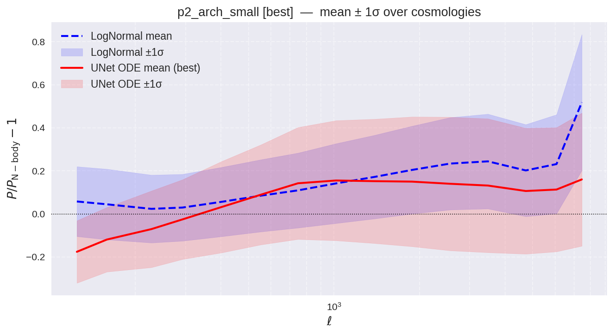 |  | 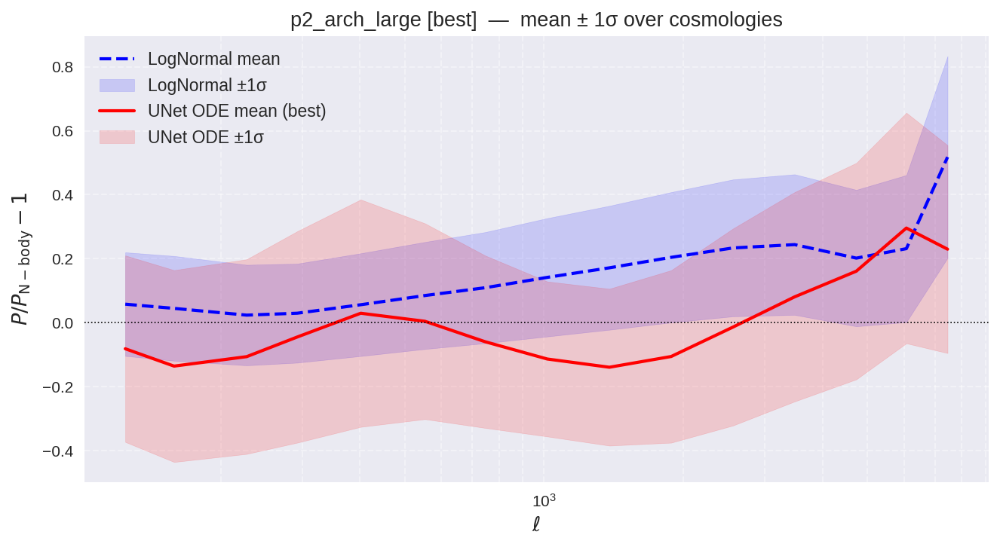 |

**Pixel PDF (best checkpoint):**

| p2_arch_small | p2_arch_medium (= p1_emd) | p2_arch_large |
|---|---|---|
|  |  | 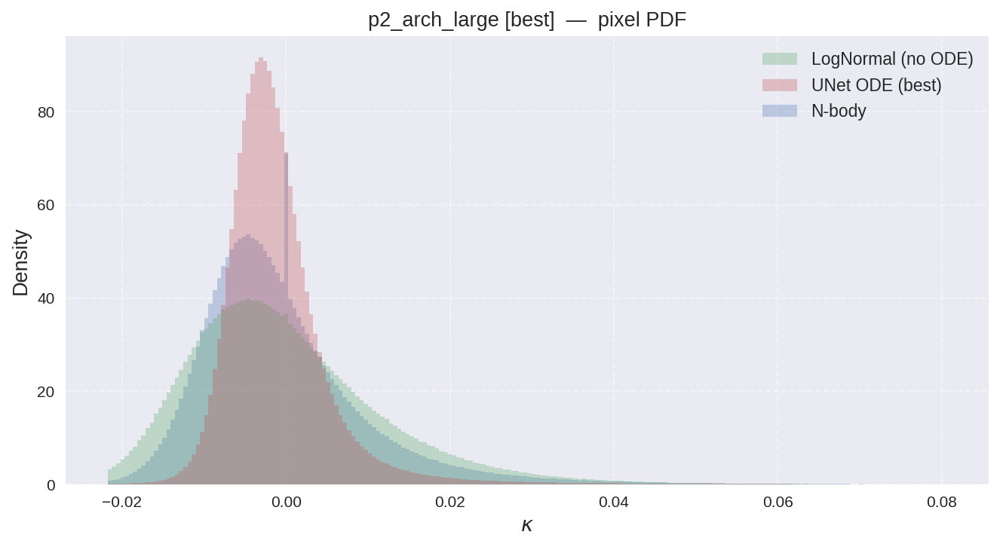 |

**Best architecture:** small [16, 32] — proceeding to Phase 3.

---

## Phase 3 — `sigma` ablation

**Varying:** FM noise level. **Fixed:** best eps + best OT + best arch.

| W&B run name | `sigma` | Config | SLURM job | `pqm/chi2_best` | `pqm/chi2_last` | `val_loss` | Notes |
|--------------|---------|--------|-----------|-----------------|-----------------|------------|-------|
| `unet/phase3/sigma_1e-4` | 0.0001 | [config](../configs/experiments/unet_exp/phase3_sigma_1e-4.yaml) | 8459678 | **113.03** | 108.16 | 24.61 | small arch, emd, eps=0.001 · [W&B](https://wandb.ai/cosmostat/neurips-wl-challenge/runs/fl9vjx9t) |
| `unet/phase3/sigma_1e-3` | 0.001 | [config](../configs/experiments/unet_exp/phase3_sigma_1e-3.yaml) | 8459679 | 106.64 | **106.23** | 24.76 | baseline · [W&B](https://wandb.ai/cosmostat/neurips-wl-challenge/runs/6wpl93lt) |
| `unet/phase3/sigma_1e-2` | 0.01 | [config](../configs/experiments/unet_exp/phase3_sigma_1e-2.yaml) | 8459680 | 112.37 | 110.00 | 29.08 | small arch, emd, eps=0.001 · [W&B](https://wandb.ai/cosmostat/neurips-wl-challenge/runs/50uyfjzv) |

**Power spectrum (best checkpoint):**

| sigma=1e-4 | sigma=1e-3 (baseline) | sigma=1e-2 |
|---|---|---|
| 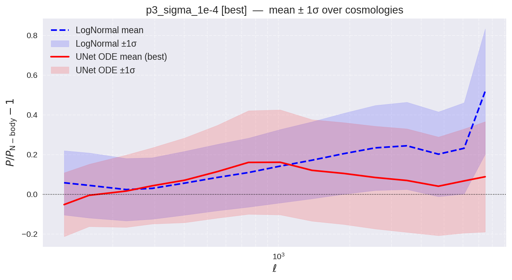 |  | 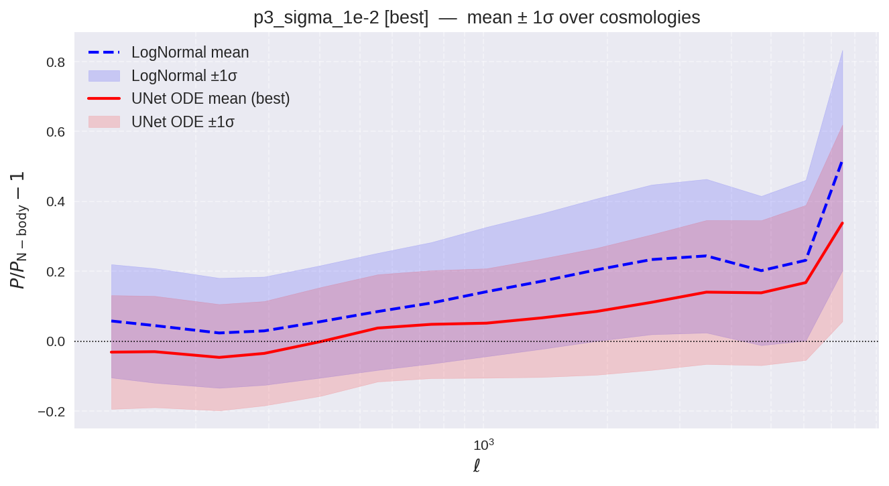 |

**Pixel PDF (best checkpoint):**

| sigma=1e-4 | sigma=1e-3 (baseline) | sigma=1e-2 |
|---|---|---|
|  | 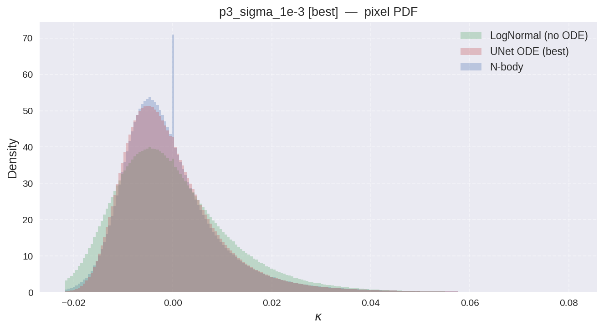 | 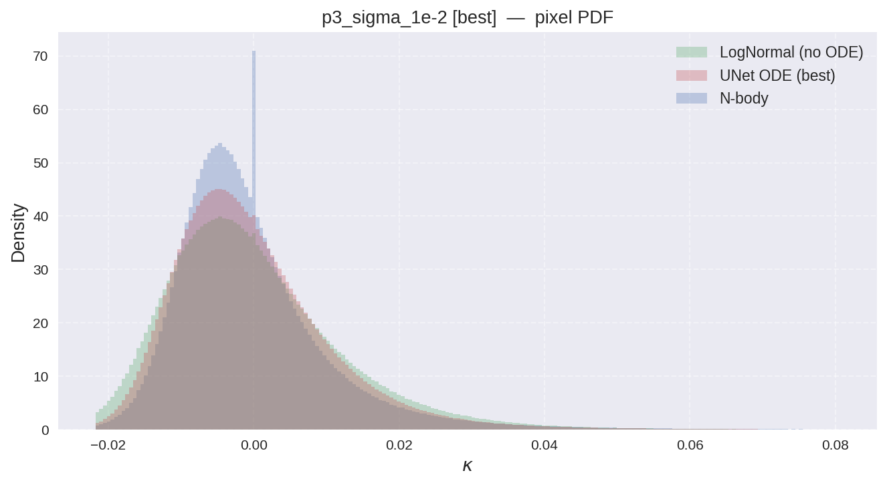 |

**Best sigma:** σ=1e-4 — proceeding to Phase 4.

---

## Phase 4 — LR schedule ablation

**Varying:** learning rate and decay. **Fixed:** best of everything above.

| W&B run name | `base_lr` | `gamma` | `num_epochs` | Config | SLURM job | `pqm/chi2_best` | `pqm/chi2_last` | `val_loss` | Notes |
|--------------|-----------|---------|--------------|--------|-----------|-----------------|-----------------|------------|-------|
| `unet/phase4/lr_gamma09_100ep` | 1e-3 | 0.9 | 100 | — | — | **113.03** | 108.16 | 24.61 | reuse p3_sigma_1e-4 · [W&B](https://wandb.ai/cosmostat/neurips-wl-challenge/runs/fl9vjx9t) |
| `unet/phase4/lr_gamma095_150ep` | 1e-3 | 0.95 | 150 | [config](../configs/experiments/unet_exp/phase4_lr_gamma095_150ep.yaml) | 8485615 | **112.42** | 109.74 | 25.85 | slower decay · [W&B](https://wandb.ai/cosmostat/neurips-wl-challenge/runs/rb62vidu) |
| `unet/phase4/lr_gamma099_150ep` | 5e-4 | 0.99 | 150 | [config](../configs/experiments/unet_exp/phase4_lr_gamma099_150ep.yaml) | 8485616 | **111.80** | 110.47 | 25.61 | nearly flat · [W&B](https://wandb.ai/cosmostat/neurips-wl-challenge/runs/sucb9fdn) |
| `unet/phase4/lr_gamma085_100ep` | 5e-4 | 0.85 | 100 | [config](../configs/experiments/unet_exp/phase4_lr_gamma085_100ep.yaml) | 8510327 | failed | 104.35 | 25.94 | aggressive decay · [W&B](https://wandb.ai/cosmostat/neurips-wl-challenge/runs/6m03w9zm) |
| `unet/phase4/lr_gamma080_100ep` | 5e-4 | 0.80 | 100 | [config](../configs/experiments/unet_exp/phase4_lr_gamma080_100ep.yaml) | 8548546 | failed | 105.50 | 26.70 | most aggressive decay · [W&B](https://wandb.ai/cosmostat/neurips-wl-challenge/runs/zxvup23d) |

**Power spectrum (best checkpoint):**

| gamma=0.9 / 100ep | gamma=0.95 / 150ep | gamma=0.99 / 150ep | gamma=0.85 / 100ep | gamma=0.80 / 100ep |
|---|---|---|---|---|
|  | 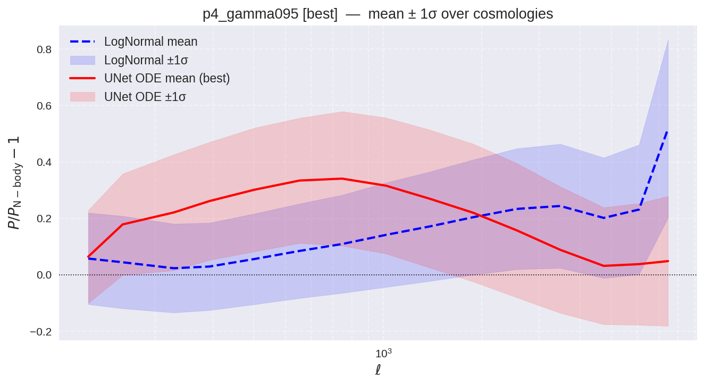 | 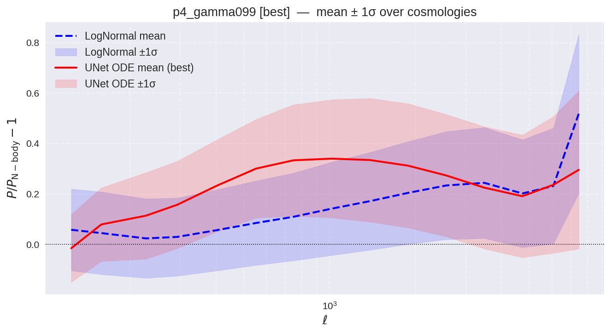 | 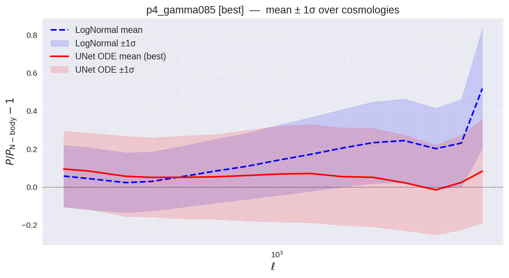 | 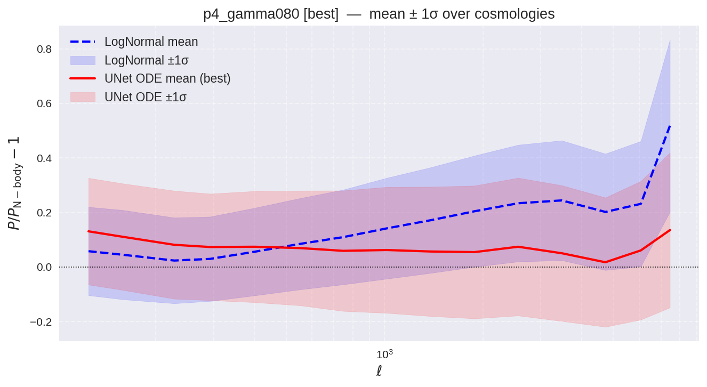 |

**Pixel PDF (best checkpoint):**

| gamma=0.9 / 100ep | gamma=0.95 / 150ep | gamma=0.99 / 150ep | gamma=0.85 / 100ep | gamma=0.80 / 100ep |
|---|---|---|---|---|
|  |  |  | 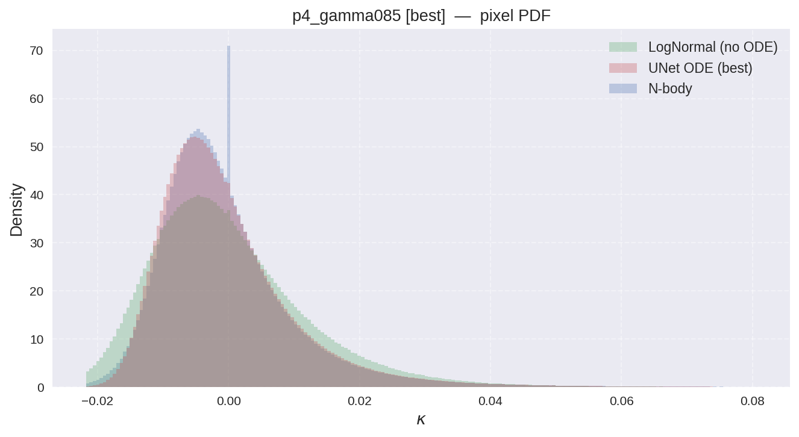 |  |

**Best LR schedule: `unet/phase4/lr_gamma085_100ep`** (`base_lr=5e-4`, `gamma=0.85`, 100 epochs) — best `chi2_last=104.35`. Note: `chi2_best` failed due to val_loss being a poor proxy; final run will use `best_ckpt_metric: pqm_chi2`.

